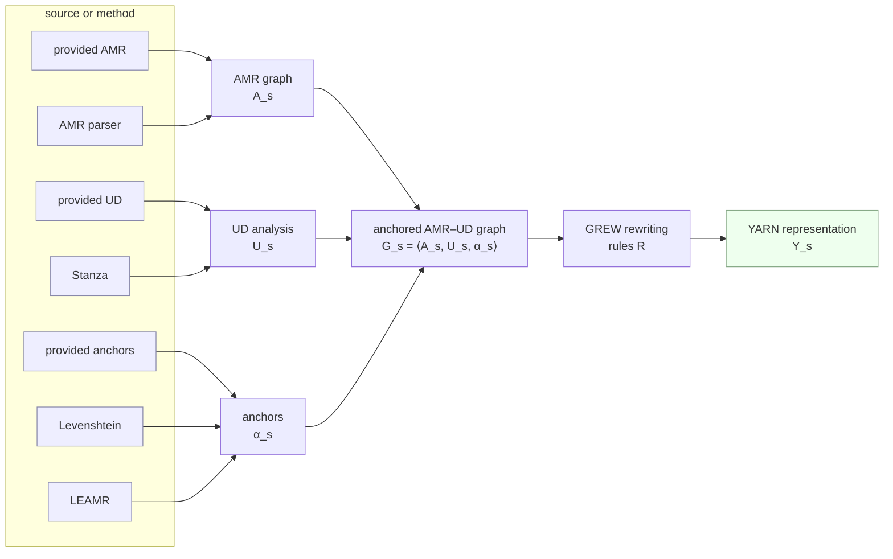

# WeaveAMRtoYARN — documentation

What this library is, and where to read about each part of it.

WeaveAMRtoYARN converts Abstract Meaning Representation graphs into YARN
representations. AMR supplies the predicate–argument structure YARN is built on, but
not everything YARN needs: negation and degree are already in the AMR, while number and
temporality are not, though they are usually marked morphologically. A Universal
Dependencies analysis of the same sentence carries that evidence, so the conversion
uses both.

Reaching the UD evidence requires knowing which token realises which AMR node, and AMR
does not say — it abstracts away from the surface form. **Anchors** supply the missing
correspondence: a mapping from AMR variables to UD tokens. Once they exist, a rule
matching an AMR node can inspect the features and dependents of the token it is
anchored to.

## The model

For a sentence *s*, write its AMR graph `A_s`, its UD analysis `U_s`, and the anchors
between them `α_s`. The three together form the **anchored AMR–UD graph**:

```
G_s = ⟨A_s, U_s, α_s⟩
```

A set of graph-rewriting rules `R` derives the YARN representation from it:

```
R(G_s) = Y_s
```

Each symbol corresponds to something concrete in the code:

| | is produced by |
|---|---|
| `A_s` | `penmanToGrew` then `normalizeGraph` — [`graph/build.py`](../src/weave_amr2yarn/graph/build.py), [`graph/normalize.py`](../src/weave_amr2yarn/graph/normalize.py) |
| `U_s` | `UdProvider.graphFor(sentence)` — [`providers/ud.py`](../src/weave_amr2yarn/providers/ud.py) |
| `α_s` | `AnchorProvider.anchorsFor(sentence, amr, ud)` — [`providers/anchors.py`](../src/weave_amr2yarn/providers/anchors.py) |
| `G_s` | `Converter.anchored(...)` — [`transform/converter.py`](../src/weave_amr2yarn/transform/converter.py) |
| `R` | the rule set in [`grs/`](../src/weave_amr2yarn/grs/)|
| `Y_s` | `Converter.convert(...)` |

Everything after this page uses ordinary names — *anchored graph*, *rule set*, *YARN* —
rather than the symbols.

## Where the parts come from

The three components of `G_s` can each be obtained in more than one way. The AMR may
come from a corpus or a parser; the UD analysis may be supplied or produced with
Stanza; the anchors may be supplied or computed. Because the rules take only `G_s`,
these choices change how the anchored graph is built and nothing about the rules
applied to it.



That substitutability is the reason the library is built around providers rather than
around one input format: a new source of AMR, UD or anchors is a new class, not an edit
to the conversion.

## The documents

Each is self-contained; read whichever answers your question.

| | |
|---|---|
| [architecture.md](architecture.md) | the layers, what each module is responsible for, and which external libraries are involved |
| [data-model.md](data-model.md) | the representations a graph passes through, and the YARN vocabulary |
| [pipeline.md](pipeline.md) | the conversion stage by stage, with the function that performs each |
| [providers.md](providers.md) | the three protocols, their implementations, and how to write one |
| [embedding.md](embedding.md) | using the library as the core of a larger transformation |
| [use-cases.md](use-cases.md) | end-to-end recipes |
| [cli.md](cli.md) | every command and flag |
| [browser-app.md](browser-app.md) | the browser app for inspecting a conversion |