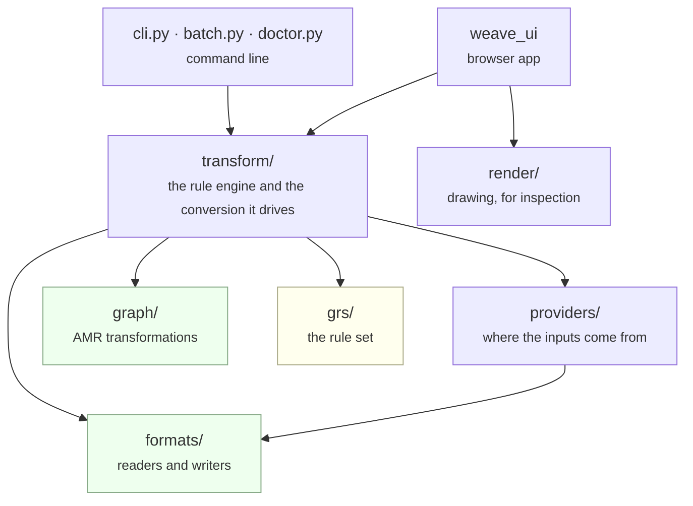

# Architecture

How the code is divided, what each part is responsible for, and what it depends on.
For what flows between the parts, see [pipeline.md](pipeline.md).

## Layers



Dependencies point downward only. The rule that keeps this honest:

> **`formats/` and `graph/` are dicts in, dicts out.** Neither imports the rule engine
> or a parser.

That is why most of the library can be tested with no engine running, and why the
representation stays a plain dict rather than a class hierarchy — the graph is data,
and every stage is a function over it.

`render/` sits to one side. It draws graphs for inspection and nothing depends on it.

## Modules

### Conversion core

| | |
|---|---|
| [`transform/converter.py`](../src/weave_amr2yarn/transform/converter.py) | `Converter` — one graph; `BatchConverter` / `BatchReport` — a corpus |
| [`transform/session.py`](../src/weave_amr2yarn/transform/session.py) | `GrsSession` — loads a rule set, applies one strategy under a timeout |
| [`transform/rules.py`](../src/weave_amr2yarn/transform/rules.py) | reads a rule set's own declarations, and which rules match a given graph |
| [`config.py`](../src/weave_amr2yarn/config.py) | `ConversionConfig` — the settings as one value |
| [`errors.py`](../src/weave_amr2yarn/errors.py) | the exception hierarchy, all under `WeaveError` |
| [`resources.py`](../src/weave_amr2yarn/resources.py) | locates the bundled rule set, so conversion works from any directory |
| [`manifest.py`](../src/weave_amr2yarn/manifest.py) | the record written beside a run's output |

### Graph transformations — dicts in, dicts out

| | |
|---|---|
| [`graph/build.py`](../src/weave_amr2yarn/graph/build.py) | Penman AMR into the working representation |
| [`graph/normalize.py`](../src/weave_amr2yarn/graph/normalize.py) | drops `:wiki`, collapses the `:name` literals |
| [`graph/anchoring.py`](../src/weave_amr2yarn/graph/anchoring.py) | merges AMR and UD into one graph, adds the anchor edges |
| [`graph/events.py`](../src/weave_amr2yarn/graph/events.py) | seeds an event node per verbally anchored predicate |
| [`graph/canonical.py`](../src/weave_amr2yarn/graph/canonical.py) | makes identifiers reproducible after rewriting |
| [`graph/dereify.py`](../src/weave_amr2yarn/graph/dereify.py) | an optional Penman-level pre-pass, off by default — the rule set does this work itself |

### Formats — readers and writers

| | |
|---|---|
| [`formats/amr.py`](../src/weave_amr2yarn/formats/amr.py) | `AmrCorpus`, `AmrSentence` |
| [`formats/conllu.py`](../src/weave_amr2yarn/formats/conllu.py) | CoNLL-U into the working representation |
| [`formats/anchors.py`](../src/weave_amr2yarn/formats/anchors.py) | `AnchorDictionary` — the anchor JSON format |
| [`formats/yarn.py`](../src/weave_amr2yarn/formats/yarn.py) | the rewritten graph into a YARN document |
| [`formats/editor.py`](../src/weave_amr2yarn/formats/editor.py) | packaging YARN graphs for the external editor |

### Providers — where the inputs come from

| | |
|---|---|
| [`providers/ud.py`](../src/weave_amr2yarn/providers/ud.py) | `ConlluUd`, `StanzaUd`, `ChainedUd` |
| [`providers/anchors.py`](../src/weave_amr2yarn/providers/anchors.py) | `PrecomputedAnchorer`, `LevenshteinAnchorer`, `ChainedAnchorer` |
| [`providers/align2anchor.py`](../src/weave_amr2yarn/providers/align2anchor.py) | `Align2AnchorAnchorer` — anchoring through the LEAMR aligner |
| [`providers/parser.py`](../src/weave_amr2yarn/providers/parser.py) | `AmrlibParser`, `SpringParser` — AMR from raw text |

See [providers.md](providers.md).

### Entry points

| | |
|---|---|
| [`cli.py`](../src/weave_amr2yarn/cli.py) | the `weave` command — see [cli.md](cli.md) |
| [`batch.py`](../src/weave_amr2yarn/batch.py) | config-driven runs over several corpora |
| [`doctor.py`](../src/weave_amr2yarn/doctor.py) | checks this machine has what the conversion needs |
| [`weave_ui/`](../src/weave_ui) | the browser app — see [browser-app.md](browser-app.md) |

## Public API

Twenty-two names are exported from `weave_amr2yarn`, and nothing else is a supported
import path:

```
AmrCorpus  AmrSentence  AnchorDictionary  readConllu
Converter  BatchConverter  BatchReport  GrsSession  ConversionConfig  bundledGrs
ConlluUd  StanzaUd  ChainedUd
PrecomputedAnchorer  LevenshteinAnchorer  ChainedAnchorer
WeaveError  AmrParseError  GrsError  GrewBackendError  ConversionTimeout  MissingDependency
```
