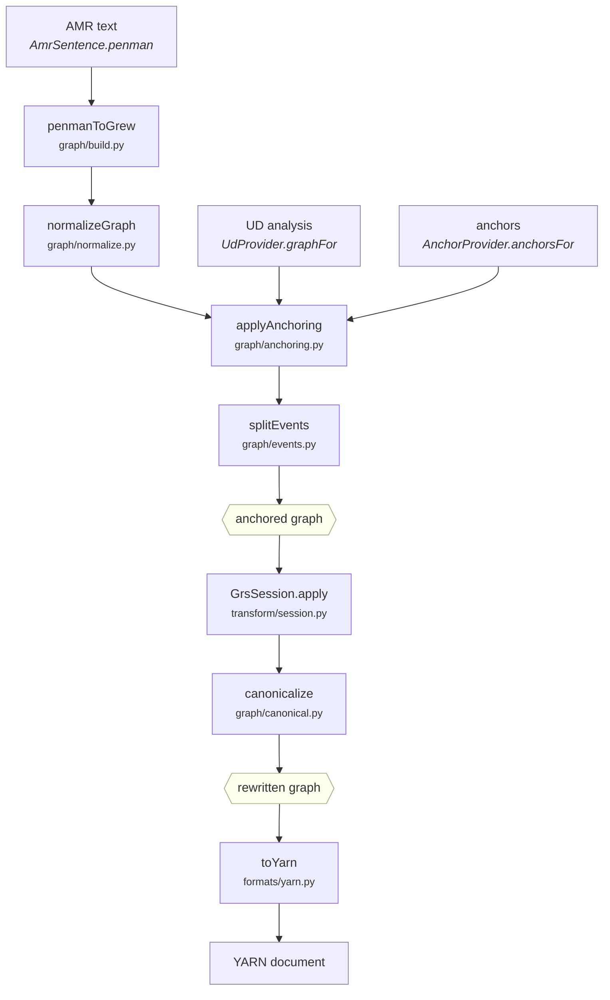

# Pipeline

What happens between an AMR string and a YARN document, in order, and which function
does each part. For the shape of the data at each point, see
[data-model.md](data-model.md).

The whole conversion is `Converter.convert`
([`transform/converter.py`](../src/weave_amr2yarn/transform/converter.py)), which is
three methods stacked:

```python
anchored(source)  →  the anchored graph          # everything before the rules
toGrew(source)    →  the rewritten graph         # anchored() + rules + canonicalise
convert(source)   →  YARN                        # toGrew() + write
```

All three are public, because the intermediate results are what you want when a
conversion comes out wrong.



## The stages

### 1. Read the AMR — `AmrCorpus` / `AmrSentence`

A `Converter` accepts either a Penman string or an `AmrSentence`. Given a bare string
it wraps it, taking the identifier from the text's own `::id` if present.

### 2. Parse into the working representation — `penmanToGrew`

[`graph/build.py`](../src/weave_amr2yarn/graph/build.py). The Penman tree becomes the
node/edge dict. Two decisions are made here that everything downstream depends on:
concepts with a PropBank sense become `pred` and the rest become `concept`, and the
root is marked `focus="yes"`.

Inverted relations are normalised in the process — AMR's `:ARG1-of` becomes an ordinary
outgoing edge — which is what lets a rule match a frame at any depth rather than only
at the root.

### 3. Tidy the AMR — `normalizeGraph`

[`graph/normalize.py`](../src/weave_amr2yarn/graph/normalize.py). Drops `:wiki`, which
carries no meaning for this conversion, and collapses the `:name` construction's string
literals into a single node.

### 4. Obtain the UD analysis — `UdProvider.graphFor(sentence)`

Returns the CoNLL-U analysis as the same node/edge dict, or `None` if it has none for
this sentence — in which case the conversion fails with a message naming the sentence
and the metadata key it looked under. See [providers.md](providers.md).

### 5. Obtain the anchors — `AnchorProvider.anchorsFor(sentence, amr, ud)`

Returns `{amrVariable: tokenId}`. Providers see the AMR and the UD, so a provider may
compute anchors rather than look them up.

### 6. Merge — `applyAnchoring`

[`graph/anchoring.py`](../src/weave_amr2yarn/graph/anchoring.py). Token nodes and
dependency edges join the AMR nodes in one dict, and each anchor becomes an `anchor`
edge. Nothing is renamed: AMR variables keep their names, tokens are keyed by index.

### 7. Seed the events — `splitEvents`

[`graph/events.py`](../src/weave_amr2yarn/graph/events.py). Mints an event node for
each predicate whose anchor is a verb or auxiliary, links it to that predicate, and
records the predicate in `core`.

This runs before the rules rather than inside them because it decides how many events
the sentence has, which the rules then take as given. It belongs to building the
anchored graph, not to rewriting it.

### 8. Rewrite — `GrsSession.apply`

[`transform/session.py`](../src/weave_amr2yarn/transform/session.py) holds the loaded
rule set and applies one strategy to a graph, under a timeout. This is the whole of the
conversion's linguistic content.

The session loads the rules once, when the `Converter` is constructed. Build one
converter and reuse it across a corpus — see [embedding.md](embedding.md).

### 9. Make identifiers reproducible — `canonicalize`

[`graph/canonical.py`](../src/weave_amr2yarn/graph/canonical.py). Renames
engine-allocated node names from the structure of the graph and numbers the events in a
fixed order, so two runs over the same input produce byte-identical output.

### 10. Write — `toYarn`

[`formats/yarn.py`](../src/weave_amr2yarn/formats/yarn.py). Sorts the typed nodes into
the nine YARN sets and emits the document.

## Configuration

`ConversionConfig` ([`config.py`](../src/weave_amr2yarn/config.py)) holds everything
the pipeline reads:

| | default | |
|---|---|---|
| `grsPath` | the bundled rules | entry file of the rule set |
| `strategy` | `eval` | which strategy to apply; validated when the session is built |
| `sentenceKey` | `snt` | metadata key holding the sentence |
| `timeoutSeconds` | `30` | per graph; `0` disables |
| `penmanDereify` | `False` | an optional pre-pass on the Penman text, off by default — the rule set does this work itself |
| `stampMetadata` | `False` | record the anchors used and the conversion time in each graph's metadata |

`stampMetadata` is off by default because it changes the output, which would otherwise
keep comparing byte-for-byte against earlier runs.

## Failure

Everything raises a subclass of `WeaveError`
([`errors.py`](../src/weave_amr2yarn/errors.py)):

| | |
|---|---|
| `AmrParseError` | the Penman text or the parser |
| `GrsError` | the rule set — a missing file, an unknown strategy |
| `GrewBackendError` | the engine, including a failed rewrite |
| `ConversionTimeout` | one graph exceeded `timeoutSeconds` |
| `MissingDependency` | an optional package or model is not installed |

Failures are per sentence. `BatchConverter` catches them, records the identifier and
the message, and carries on — see [embedding.md](embedding.md).

## Corpus runs

`BatchConverter.run(corpus, outDir)` applies a converter to every sentence and writes
`<out>/grew/<id>.json` and `<out>/yarn/<id>.json`, returning a `BatchReport` with the
counts and per-sentence failures. `--layout grouped` splits an identifier like
`fracas-001.premise_0` into `fracas-001/premise_0.json` instead.

Each run also writes `manifest.json`
([`manifest.py`](../src/weave_amr2yarn/manifest.py)) beside the output: when it ran,
the inputs, the strategy, the providers, the counts and the failures. The rules are
identified by a digest over the whole rule directory rather than the entry file —
`main.grs` includes 43 siblings and the rules load lexicons, so hashing the entry alone
would call two different rule sets identical.
