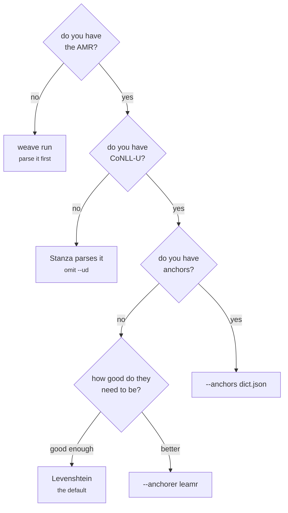

# Use cases

End-to-end recipes. Every flag is in [cli.md](cli.md); calling the library from Python
is in [embedding.md](embedding.md).

Which recipe you want depends on what you already have:



## A corpus with everything

The best case, and the fastest: gold AMR, gold UD, anchors already built.

```bash
weave convert --amr corpus.amr.txt \
              --ud corpus.conllu \
              --anchors anchors.json \
              --out out/
```

Output is `out/grew/<id>.json`, `out/yarn/<id>.json` and `out/manifest.json`. Nothing
is parsed and no models are needed.

Add `--strict-ud` if you expect the CoNLL-U to cover every sentence — without it, a
sentence it misses is quietly parsed with Stanza instead, which is easy not to notice.

## A corpus with only the AMR

```bash
weave convert --amr corpus.amr.txt --out out/
```

Stanza parses the UD from each sentence's `::snt` metadata, and anchors are computed by
edit distance. Needs `pip install 'weave-amr2yarn[stanza]'` and the English models.

If the sentence lives under a different metadata key: `--key-snt text`.

## Better anchors: LEAMR

In one step, converting as it goes:

```bash
weave convert --amr corpus.amr.txt --ud corpus.conllu \
              --anchorer leamr --out out/
```

Anchoring is a corpus-level step, so the aligner runs once over the whole corpus before
conversion starts. Sentences it does not cover fall back to edit distance.

In two steps, which is what you want if the run will be repeated — the dictionary
becomes an artifact you can inspect, diff and reuse instead of realigning every time:

```bash
weave anchors --amr corpus.amr.txt --ud corpus.conllu --out anchors.json
weave convert --amr corpus.amr.txt --ud corpus.conllu \
              --anchors anchors.json --out out/
```

`--audit decisions.tsv` records what the filter stage decided, and `--stages` selects
which stages run at all (`filter,repair` by default; pass an empty value for the raw
alignment).

## From raw text

```bash
pip install 'weave-amr2yarn[parse]'
# download a model from https://github.com/bjascob/amrlib-models and unpack it

weave run --text sentences.txt --out out/ \
          --amr-model /path/to/model \
          --save-amr parsed.amr.txt
```

One sentence per line. Models are not bundled — the smallest is around 500 MB — so
point at one with `--amr-model` or `WEAVE_AMR_MODEL`.

To use LEAMR you need the AMR and the UD as files, since the aligner works on files
rather than in-memory graphs — keep the parse with `--save-amr` and supply a CoNLL-U
covering the same identifiers:

```bash
weave run --text sentences.txt --out out/ --amr-model MODEL \
          --save-amr parsed.amr.txt --ud sentences.conllu --anchorer leamr
```

A parser can also run as a service, which keeps its dependencies out of this
environment entirely:

```bash
weave run --text sentences.txt --out out/ --parser spring \
          --spring-endpoint http://localhost:8080/parse
```

## Several corpora

Put the sweep in a config file rather than a shell loop — the file is then the record
of what was run.

```toml
# weave.toml
out_root = "runs"

[defaults]
strat = "eval"
key_snt = "snt"
timeout = 0

[corpus.fracas]
amr = "input/fracas.amr.txt"
ud = "input/fracas.conllu"
anchors = "anchors/fracas.json"

[corpus.lpp]
amr = "input/lpp.amr.txt"
ud = "input/lpp.conllu"
anchors = "anchors/lpp.json"
layout = "grouped"
```

```bash
weave batch --config weave.toml
weave batch --config weave.toml --only fracas       # just one
weave batch --config weave.toml --out-root /tmp/x   # somewhere else
```

Each corpus writes to `<out_root>/<name>/{grew,yarn}`. `[defaults]` applies to every
corpus and each section overrides it. Any `convert` option works as a key, in either
`snake_case` or `camelCase`. Paths resolve relative to the config file, so it travels
with its data, and a corpus that fails is reported without abandoning the rest.

Comments in the file are worth writing: a config is the place to record *why* a setting
is what it is — why the timeout is disabled, why an option is off — where a shell loop
would lose it.

## Comparing two runs

Output is deterministic: identifiers are canonical and two conversions of the same
input are byte-identical. So a plain diff is a meaningful comparison.

```bash
weave convert --amr corpus.amr.txt --ud corpus.conllu --out before/ --strat eval
weave convert --amr corpus.amr.txt --ud corpus.conllu --out after/  --strat eval_noref
diff -r before/yarn after/yarn
```

`weave strats` lists the strategies the rule set declares, including the ablations —
running two of them over the same corpus and diffing is what they are for.
`manifest.json` differs by design: it carries timings and a digest of the rule set, so
compare `grew/` and `yarn/` only.

Note that `--stamp-meta` changes the output, which is why it is off by default.

## Handing the output to the editor

```bash
weave export --yarn out/yarn --out sample.zip
```

Renames the graphs to `.yarn.json` and adds the metadata the external editor expects.
`--jsonl` writes a single file instead, which is easier to move around.

The browser app can do the same for a run and open a single graph in the editor
directly — see [browser-app.md](browser-app.md).

## Checking a machine

```bash
weave doctor      # what is installed, what is missing, and the fix for each
weave strats      # the rule set loads and declares its strategies
```

Worth running in that order before a long sweep. `weave strats` in particular catches a
broken rule set: a bad package reference loads cleanly and fails only when a strategy
actually runs.
